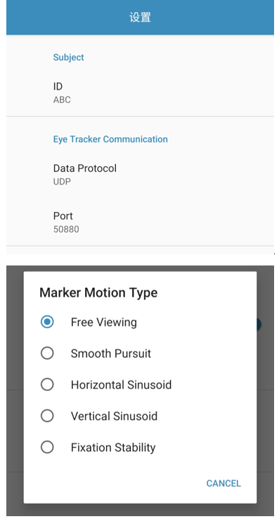
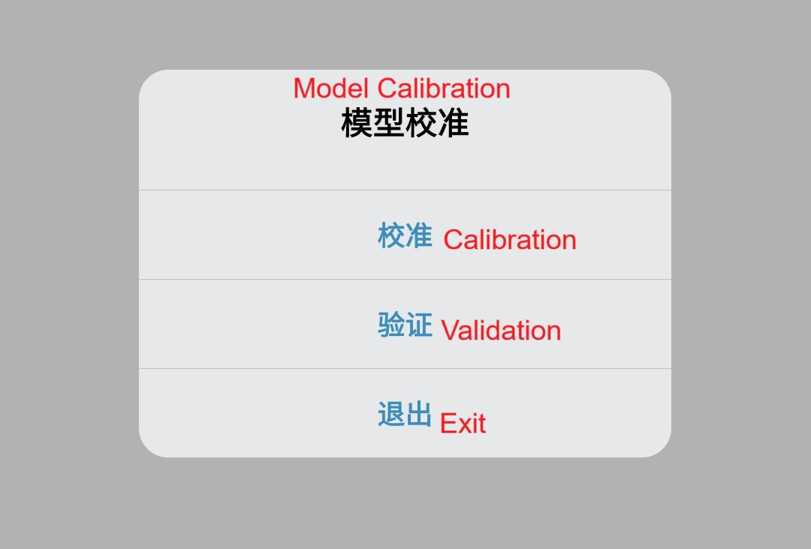

# Smartphone Eye Tracking for Depression Symptom Detection

This library is for Depression SymptomDetection using mobile eye tracking. 
It is based on an older version of TCCI Smartphone Eye Tracking SDK.

## Smartphone Eye Tracking SDK

Please send an email to zhiguo@zju.edu.cn. Upon successful processing of your request,
you will receive an email containing the Smartphone Eye Tracking SDK.

### Email Prompt

Here’s a template for your request email. Please keep the subject line unchanged:

```
Subject: Request for Access to the Smartphone Eye Tracking SDK

Dear Prof. Zhiguo Wang,

I hope this message finds you well.

My name is [Your Name], and I am a [student/researcher] at [Your Affiliation]. I am writing to request the Smartphone Eye Tracking SDK.

I assure you that I will use this SDK solely for academic and research purposes and will not utilize it for commercial activities or share it with others.

Thank you for considering my request. I look forward to receiving access to the SDK.

Best regards,
[Your Name]
```

### How to use the SDK

Given that the SDK name is `lib-gaze-tracker-release.aar`. Please use the following command to add the SDK to this project.
```
git clone https://github.com/GanchengZhu/SmartphoneEyeTrackingDepression
cd SmartphoneEyeTrackingDepression
mv {sdk folder}/lib-gaze-tracker-release.aar ./lib-gaze-tracker
```
The SDK Documentation please refers to [this page](https://github.com/GanchengZhu/eye_tracking_data_quality_analysis/).

## Software Preparation

- Android Studio Iguana | 2023.2.1 Patch 1

## How to install the App on the phone

Method 1: Direct Deployment via Android Studio

- Use USB debugging mode to deploy the app directly to your phone through Android Studio.
- For details, refer to the official guide: https://developer.android.com/studio/run.

Method 2: Build APK and Install Manually

- In the Android Studio menu bar, go to `Build` → `Build Bundle(s) / APK(s)` → `Build APK(s)`.
- Locate the generated APK file (usually in app/build/outputs/apk/debug/).
- Transfer the APK to your phone, open it in your file manager, and follow the prompts to install.

## Usage steps

- 1. Install and open this app. Input participant's id and select a task (free viewing, Smooth 
Pursuit or Fixation Stability). Click the `NEXT` button.


- 2. Calibration and validation. Instruct the participant to maintain fixation on the red dot inside the small circle.  


- 3. After completing calibration and validation, click the `退出`(exit) button to exit the calibration phase and 
enter a cognitive task (you chose at step 1).

- 4. Complete the task and all data can be found `/sdcard/Android/data/com.example.gaze.record`. For Android 11, you could not be allowed to access this folder. Please grant shell permission to MTManager(https://mt2.cn/) by
     installing Shizuku (https://shizuku.rikka.app/) and activating it. 

